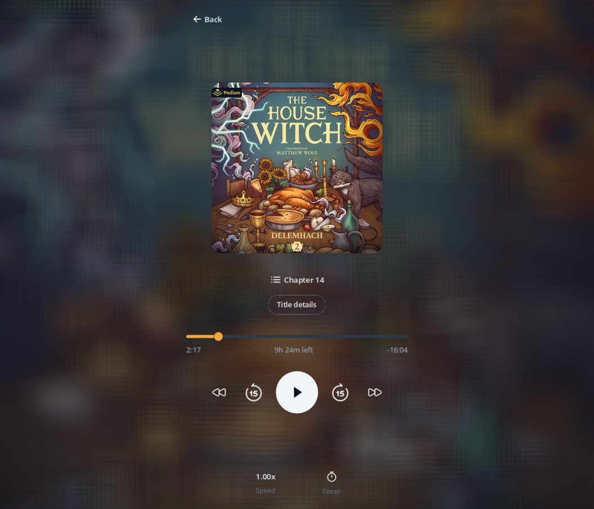
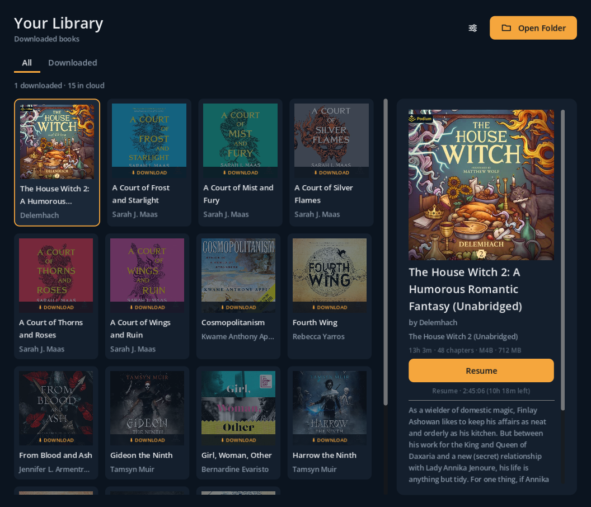
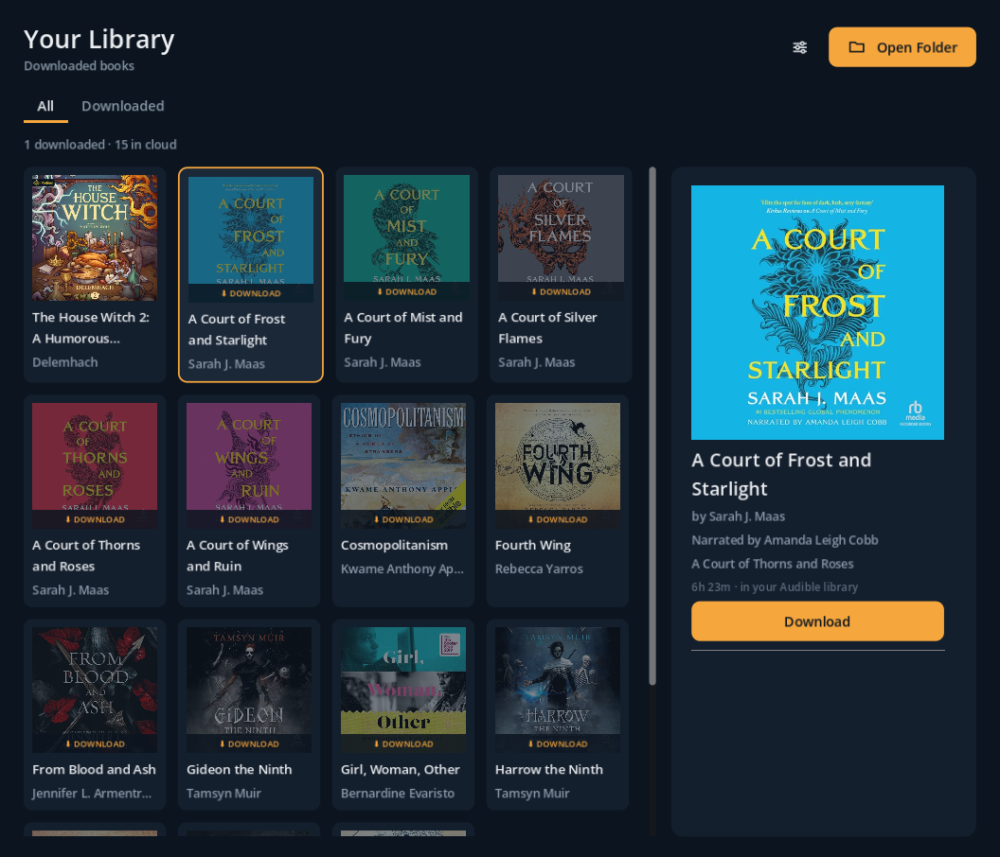
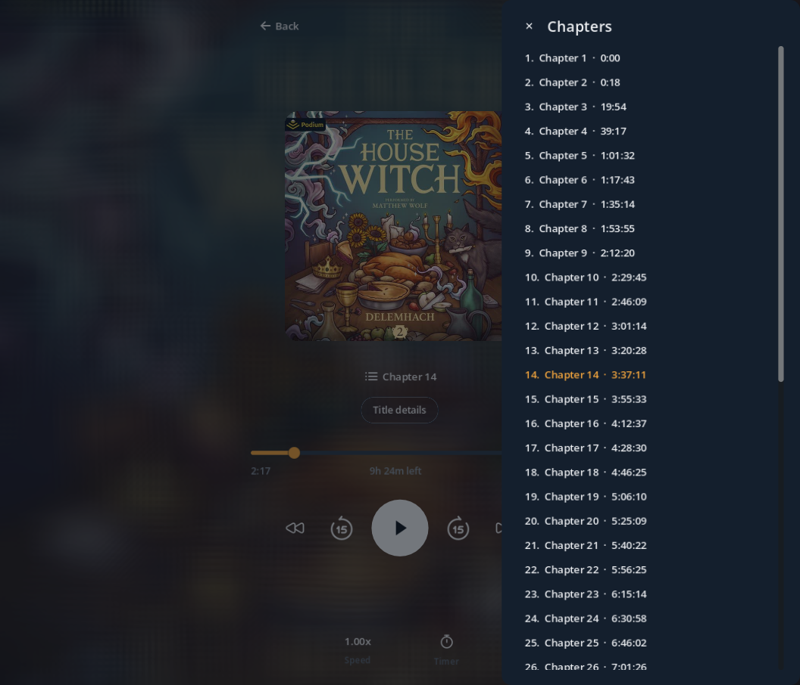

<div align="center">

# 🎧 Audiobooks

**A polished desktop audiobook player with an Audible‑style listening experience.**

Open a folder of your own files, or connect your Audible account to sync and
download your library — decrypted on‑device to clean, DRM‑free `m4b`.




</div>

---

## Why?

Most audiobook apps are either locked to one store or feel nothing like the app
you actually enjoy listening in. **Audiobooks** gives you a clean, distraction‑free
player modeled on the Audible experience, while keeping your library as plain,
portable files you own. Point it at a folder of `mp3`/`m4b` files, or connect your
Audible account and pull your library down — converted to standard, DRM‑free `m4b`
with chapters and cover art intact.

It's built in Godot with **no Python and no external services** — the only thing
it shells out to is `ffmpeg`.

## Features

- **Audible‑style player** — frosted cover backdrop, chapter list, 15‑second skip,
  chapter navigation, a scrubber scoped to the current chapter, and whole‑book
  "time left."
- **Variable speed without the chipmunk effect** — true time‑stretch via a
  pitch‑shift audio bus.
- **Remembers your place** — per‑book resume, plus a sleep timer.
- **Bring your own files** — scan any folder of `mp3` / `m4b` audiobooks.
- **Connect Audible** — a native, no‑Python sign‑in (your password, CAPTCHA and
  2FA stay in your browser) syncs your library and fetches your activation bytes.
- **Download & convert** — books download and are losslessly remuxed to DRM‑free
  `m4b` (chapters + cover preserved), then pre‑prepared for **instant playback**.
- **Resumable** — if you quit mid‑download, it picks up from the last completed
  step on next launch.
- **All / Downloaded tabs** — browse everything or just what's on disk; cloud‑only
  titles are clearly badged.

## Screenshots

<table>
  <tr>
	<td width="50%"></td>
	<td width="50%"></td>
  </tr>
  <tr>
	<td align="center"><em>Your library — local files and your Audible cloud library in one grid</em></td>
	<td align="center"><em>Cloud titles show full details and a one‑click Download</em></td>
  </tr>
  <tr>
	<td width="50%"></td>
	<td width="50%"></td>
  </tr>
  <tr>
	<td align="center"><em>Jump around with the chapters panel</em></td>
	<td align="center"><em>A calm, focused now‑playing screen</em></td>
  </tr>
</table>

## Requirements

- **[ffmpeg](https://ffmpeg.org/) and ffprobe** on your `PATH`. This is the one hard
  dependency — it's used to read metadata, extract cover art, and decrypt/convert audio.

  | OS | Install |
  |----|---------|
  | Linux | `sudo apt install ffmpeg` (or your distro's package) |
  | macOS | `brew install ffmpeg` |
  | Windows | `winget install Gyan.FFmpeg` (or download from ffmpeg.org and add it to `PATH`) |

## Install

1. Grab the latest build for your platform from the
   **[Releases](https://github.com/codeWonderland/audiobooks/releases)** page.
2. Make sure `ffmpeg` is installed (see above).
3. Extract and run:
   - **Linux** — `chmod +x Audiobooks.x86_64 && ./Audiobooks.x86_64`
   - **Windows** — run `Audiobooks.exe`
   - **macOS** — open `Audiobooks.app` (you may need to allow it in
	 *System Settings → Privacy & Security* the first time)

## Getting started

**Listen to files you already have**
1. Click **Open Folder** and choose a folder of `mp3` / `m4b` audiobooks.
2. Select a book to see its details, then hit **Play**.

**Or connect your Audible account**
1. Open **Settings** (the sliders icon) → **Connect Audible account**.
2. Pick your marketplace and click **Open Amazon sign‑in**. Sign in *in your
   browser* — Audiobooks never sees your password, and CAPTCHA/2FA happen on
   Amazon's own page.
3. After signing in you'll land on a blank `…/ap/maplanding?…` page. Copy that full
   address from the address bar, paste it back into the app, and click
   **Finish sign‑in**.
4. Switch to the **All** tab to see your whole library. Select any cloud title and
   click **Download** — it downloads, converts to `m4b`, and is ready to play.

Downloaded books live in the app's data folder by default; you can still scan a
separate custom folder alongside them.

## How it works

- **Audible sign‑in** is the standard device‑registration flow, implemented
  natively with Godot's `Crypto` and `HTTPRequest` (PKCE, RSA‑SHA256 request
  signing) — no Python, no bundled binaries. See
  [`docs/audible-protocol.md`](docs/audible-protocol.md).
- **Decryption & conversion** run through `ffmpeg`: `.aax` uses your account
  activation bytes, `.aaxc` uses a per‑file voucher decrypted on‑device, and the
  result is remuxed (no re‑encode) to a DRM‑free `.m4b`.
- **Playback** decodes to a cached Ogg stream so seeking, chapter jumps and speed
  changes are instant. Godot plays `mp3` natively; everything else is prepared once.

## Personal use & legality

This is a personal‑use, format‑shifting tool for audiobooks **you own**. It doesn't
crack, share, or redistribute anything — it lets you keep the books you've purchased
as standard, DRM‑free files you can back up and play in one nice app, the same idea
as ripping a CD you bought. Please only use it with your own account and your own
library, and respect Audible's and your local laws' terms.

This project is **not affiliated with, endorsed by, or associated with** Audible or
Amazon.

## Build from source

```bash
git clone https://github.com/codeWonderland/audiobooks.git
cd audiobooks
# open the project in Godot 4.7.1, or run headless:
godot .
```

Requires **Godot 4.7.1** and `ffmpeg`/`ffprobe` on your `PATH`. The project is
organized with an `assets/` folder (theme, icons, shaders) and a `source/` folder
(scenes + scripts kept together per feature).

## Roadmap

- Encrypt the stored account credentials at rest
- More Audible marketplaces in the sign‑in picker
- Playback bookmarks / clips
- Optional Opus output for smaller files

## Acknowledgements

- Protocol reference for the Audible device‑auth flow:
  [mkb79/Audible](https://github.com/mkb79/Audible)
- [ffmpeg](https://ffmpeg.org/) for the heavy lifting
- Built with [Godot Engine](https://godotengine.org/)

## License

Released under the [MIT License](LICENSE).
